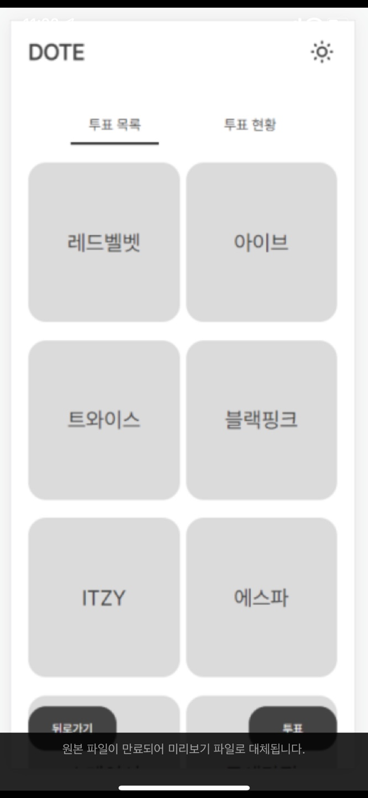

# [Dote](https://dotedgsw.netlify.app/)

  

도트는 대소고에서 매학기마다 열리는 축제에서 팀을 투표하는 과정을 간편하게 웹으로 투표할 수 있게 하기 위해 기획되고, 개발된 축제 팀 투표 사이트에요.

> 아쉽지만 해당 서비스는 Dauth 로그인만 지원하고 있어, 대소고학생 들만 사용할 수 있어요 🥲

도트에서는 매 학기말이 되면 소프트웨어 축제가 열려요. 소프트웨어 축제에서는 학생들이 여러 부스를 운영하면서 여러 체험을 하거나 맛있는 걸 먹기도 하고, 학생들이 장기자랑 공연에 참가하여 춤이나 랩 노래 등 여러 끼를 마음껏 뽐내고 상금을 받아가기도 해요. 도트는 그때 공연팀의 인기투표를 위해 만들어진 웹사이트에요 😁

# 프로젝트 기능

- 팀 투표
  - 관리자가 투표를 생성하고 사용자가 팀을 투표할 수 있습니다. 투표는 단 1번만 할 수 있습니다.
- 투표 현황
  - 진행되고 있는 투표를 실시간으로 조회할 수 있습니다.

# 도트 화면

> 위 사진은 도트의 메인페이지 현황 섹션이에요. 등록된 투표의 현황을 실시간으로 확인할 수 있어요.

> 위 사진은 도트의 투표페이지에요. 팀중에 한팀을 투표할 수 있어요.

# 기술스택

`React`,`Styled-Components`,`Axios`,`TypeScript`,`React-Query`

# 링크

https://dotedgsw.netlify.app/
